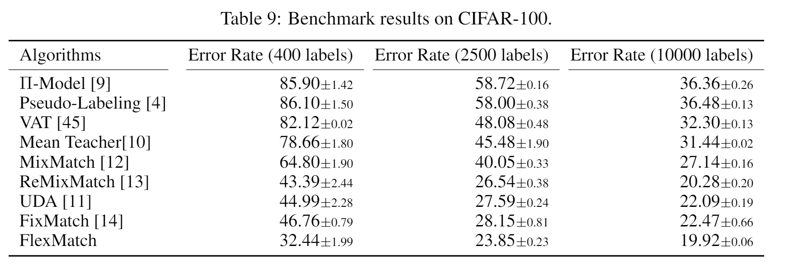

# TorchSSL: A PyTorch-based Toolbox for Semi-Supervised Learning

An all-in-one toolkit based on PyTorch for semi-supervised learning (SSL). We implmented 8 popular SSL algorithms to enable fair comparison and boost the development of SSL algorithms.


## Supported algorithms

We support fully supervised training + 9 popular SSL algorithms as listed below:

1. Pi-Model [1]
2. MeanTeacher [2]
3. Pseudo-Label [3]
4. VAT [4]
5. MixMatch [5]
6. UDA [6]
7. ReMixMatch [7]
8. FixMatch [8]
9. FlexMatch [9]

Besides, we implement our Curriculum Pseudo Labeling (CPL) method for Pseudo-Label (Flex-Pseudo-Label) and UDA (Flex-UDA).

## Supported datasets

We support 5 popular datasets in SSL research as listed below:

1. CIFAR-10
2. CIFAR-100
3. STL-10
4. SVHN
5. ImageNet


## Installation

1. Prepare conda
2. Run `conda env create -f environment.yml`


## Usage

It is convenient to perform experiment with TorchSSL. For example, if you want to perform FlexMatch algorithm:

1. Modify the config file in `config/flexmatch/flexmatch.yaml` as you need
2. Run `python flexmatch --c config/flexmatch/flexmatch.yaml`

## Customization

If you want to write your own algorithm, please follow the following steps:

1. Create a directory for your algorithm, e.g., `SSL`, write your own model file `SSl/SSL.py` in it. 
2. Write the training file in `SSL.py`
3. Write the config file in `config/SSL/SSL.yaml`

## Results




### Citation
If you think this toolkit or the results are helpful to you and your research, please cite our paper:

```
@article{zhang2021flexmatch},
  title={FlexMatch: Boosting Semi-supervised Learning with Curriculum Pseudo Labeling},
  author={Zhang, Bowen and Wang, Yidong and Hou Wenxin and Wu, Hao and Wang, Jindong and Okumura, Manabu and Shinozaki, Takahiro},
  booktitle={Neural Information Processing Systems (NeurIPS)},
  year={2021}
}
```

### Maintainer
Yidong Wang<sup>1</sup>, Hao Wu<sup>2</sup>, Bowen Zhang<sup>1</sup>, Wenxin Hou<sup>1,3</sup>, Jindong Wang<sup>3</sup>

Shinozaki Lab<sup>1</sup> http://www.ts.ip.titech.ac.jp/

Okumura Lab<sup>2</sup> http://lr-www.pi.titech.ac.jp/wp/

Microsoft Research Asia<sup>3</sup>

### References

[1] Antti Rasmus, Harri Valpola, Mikko Honkala, Mathias Berglund, and Tapani Raiko.  Semi-supervised learning with ladder networks. InNeurIPS, pages 3546–3554, 2015.
[2] Antti Tarvainen and Harri Valpola.  Mean teachers are better role models:  Weight-averagedconsistency targets improve semi-supervised deep learning results. InNeurIPS, pages 1195–1204, 2017.
[3] Dong-Hyun Lee et al. Pseudo-label: The simple and efficient semi-supervised learning methodfor  deep  neural  networks.   InWorkshop  on  challenges  in  representation  learning,  ICML,volume 3, 2013.
[4] Takeru Miyato, Shin-ichi Maeda, Masanori Koyama, and Shin Ishii. Virtual adversarial training:a regularization method for supervised and semi-supervised learning.IEEE TPAMI, 41(8):1979–1993, 2018.
[5] David Berthelot, Nicholas Carlini, Ian Goodfellow, Nicolas Papernot, Avital Oliver, and ColinRaffel. Mixmatch: A holistic approach to semi-supervised learning.NeurIPS, page 5050–5060,2019.
[6] Qizhe Xie, Zihang Dai, Eduard Hovy, Thang Luong, and Quoc Le. Unsupervised data augmen-tation for consistency training.NeurIPS, 33, 2020.
[7] David Berthelot, Nicholas Carlini, Ekin D Cubuk, Alex Kurakin, Kihyuk Sohn, Han Zhang,and Colin Raffel.   Remixmatch:  Semi-supervised learning with distribution matching andaugmentation anchoring. InICLR, 2019.
[8] Kihyuk Sohn, David Berthelot, Nicholas Carlini, Zizhao Zhang, Han Zhang, Colin A Raf-fel, Ekin Dogus Cubuk, Alexey Kurakin, and Chun-Liang Li.  Fixmatch:  Simplifying semi-supervised learning with consistency and confidence.NeurIPS, 33, 2020.
[9] 
