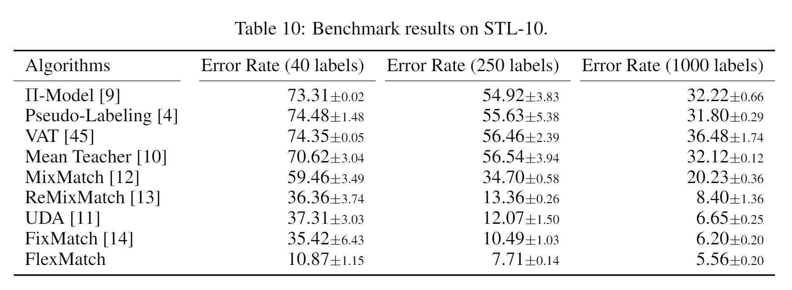

## TorchSSL: A PyTorch-based Toolbox for Semi-Supervised Learning

An all-in-one toolkit based on PyTorch for semi-supervised learning (SSL). We implmented 8 popular SSL algorithms to enable fair comparison and boost the development of SSL algorithms.


### Implemented Algorithms & Datasets

We support fully supervised training + 9 popular SSL algorithms as listed below:

1. Pi-Model
2. MeanTeacher
3. Pseudo-Label
4. VAT
5. MixMatch
6. UDA
7. ReMixMatch
8. FixMatch
9. FlexMatch

Besides, we implement our Curriculum Pseudo Labeling (CPL) method for Pseudo-Label (Flex-Pseudo-Label) and UDA (Flex-UDA).

We support 5 popular datasets in SSL research as listed below:

1. CIFAR-10
2. CIFAR-100
3. STL-10
4. SVHN
5. ImageNet


### Installation

1. Prepare conda
2. Run `conda env create -f environment.yml`


### Usage

It is convenient to perform experiment with TorchSSL. For example, if you want to perform FlexMatch algorithm:

1. Modify the config file in `config/flexmatch/flexmatch.yaml` as you need
2. Run `python flexmatch --c config/flexmatch/flexmatch.yaml`

### Customization

If you want to write your own algorithm, please follow the following steps:

1. Create a directory for your algorithm, e.g., `SSL`, write your own model file `SSl/SSL.py` in it. 
2. Write the training file in `SSL.py`
3. Write the config file in `config/SSL/SSL.yaml`

### Results




### References

[1] "FlexMatch: Boosting Semi-Supervised Learningwith Curriculum Pseudo Labeling"

### Maintainer
Yidong Wang<sup>1</sup>, Hao Wu<sup>2</sup>, Bowen Zhang<sup>1</sup>, Wenxin Hou<sup>1,3</sup>, Jindong Wang<sup>3</sup>

Shinozaki Lab<sup>1</sup> http://www.ts.ip.titech.ac.jp/

Okumura Lab<sup>2</sup> http://lr-www.pi.titech.ac.jp/wp/

Microsoft Research Asia<sup>3</sup>


### Citation
If you think this toolkit or the results are helpful to you and your research, please cite [1]!

```
