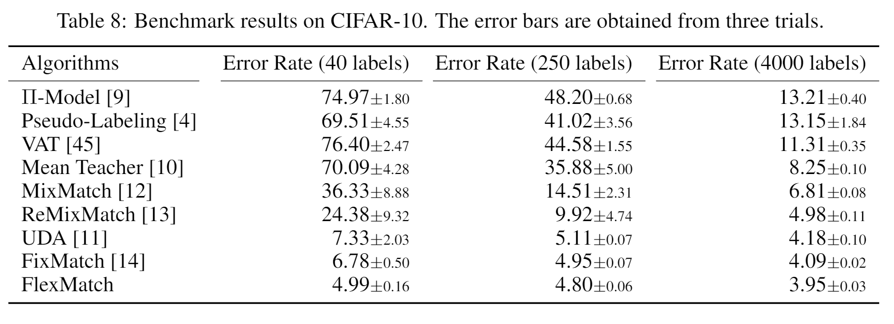
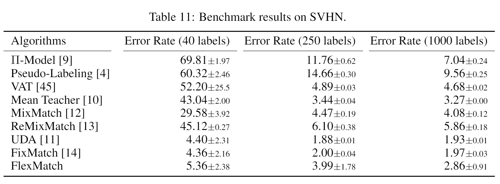

# News
1. The results of BestAcc have been updated! Note that we still have some experiments running in Azure, we will update all results and upload logs if all things done. I use single P100 for CIFAR-10 and SVHN, single P40 for STL-10, signle V100-32G for CIFAR-100.
2. I have been using hundreds of GPUs of Azure to re-run all the experiments in the paper. I will clarify the gpu for each algorithm and dataset. Besides I will make all the log files available in TorchSSL git repo. Please wait for my updates. I will gradually upload all log files in 2 months.
3. If you want to join TorchSSL team, please e-mail Yidong Wang (646842131@qq.com; yidongwang37@gmail.com) for more information. We plan to add more SSL algorithms and expand TorchSSL from CV to NLP and Speech.
# TorchSSL: A PyTorch-based Toolbox for Semi-Supervised Learning

An all-in-one toolkit based on PyTorch for semi-supervised learning (SSL). We implmented 9 popular SSL algorithms to enable fair comparison and boost the development of SSL algorithms.

FlexMatch: Boosting Semi-Supervised Learning with Curriculum Pseudo Labeling(https://arxiv.org/abs/2110.08263)


## Supported algorithms

We support fully supervised training + 9 popular SSL algorithms as listed below:

1. Pi-Model [1]
2. MeanTeacher [2]
3. Pseudo-Label [3]
4. VAT [4]
5. MixMatch [5]
6. UDA [6]
7. ReMixMatch [7]
8. FixMatch [8]
9. FlexMatch [9]

Besides, we implement our Curriculum Pseudo Labeling (CPL) method for Pseudo-Label (Flex-Pseudo-Label) and UDA (Flex-UDA).

## Supported datasets

We support 5 popular datasets in SSL research as listed below:

1. CIFAR-10
2. CIFAR-100
3. STL-10
4. SVHN
5. ImageNet


## Installation

1. Prepare conda
2. Run `conda env create -f environment.yml`


## Usage

It is convenient to perform experiment with TorchSSL. For example, if you want to perform FlexMatch algorithm:

1. Modify the config file in `config/flexmatch/flexmatch.yaml` as you need
2. Run `python flexmatch.py --c config/flexmatch/flexmatch.yaml`

## ImageNet Dataset

Please download the ImageNet 2014 dataset (unchanged from 2012) from the official site (link: https://image-net.org/challenges/LSVRC/2012/2012-downloads.php)

Extract the train and the test set into *subfolders* (the val set is not used), and put them under `train/` and `val/` respectively. Each subfolder will represent a class.

Note: the offical test set is not zipped into subfolders by classes, you may want to use: https://github.com/jiweibo/ImageNet/blob/master/valprep.sh, which is a nice script for preparing the file structure.

## Customization

If you want to write your own algorithm, please follow the following steps:

1. Create a directory for your algorithm, e.g., `SSL`, write your own model file `SSl/SSL.py` in it. 
2. Write the training file in `SSL.py`
3. Write the config file in `config/SSL/SSL.yaml`

## Results
<!--




-->
### CIFAR-10 and CIFAR-100
|                      |              CIFAR-10                ||              CIFAR100                |
|----------------------|------------|------------|------------||------------|------------|------------|
|                      | 40         | 250        | 4000       || 400        | 2500       | 10000      |
| fullysupervised      | 95.38±0.05 | 95.39±0.04 | 95.38±0.05 || 80.7±0.09  | 80.7±0.09  | 80.73±0.05 |
|----------------------|------------|------------|------------||------------|------------|------------|
| pimodel [1]          | 25.66±1.76 | 53.76±1.29 | 86.87±0.59 || 13.04±0.8  | 41.2±0.66  | 63.35±0.0  |
| pseudolabel [3]      | 26.26±1.96 | 53.86±1.81 | 85.25±0.19 || 14.28±0.46 | 43.88±0.51 | 64.4±0.15  |
| pseudolabel_flex [9] | 26.26±1.96 | 53.86±1.81 | 85.25±0.19 || 14.28±0.46 | 43.88±0.51 | 64.4±0.15  |
| meanteacher [2]      | 29.91±1.6  | 62.54±3.3  | 91.9±0.21  || 18.89±1.44 | 54.83±1.06 | 68.25±0.23 |
| vat [4]              | 25.34±2.12 | 58.97±1.79 | 89.49±0.12 || 14.8±1.4   | 53.16±0.79 | 67.86±0.19 |
| mixmatch [5]         | 63.81±6.48 | 86.37±0.59 | 93.34±0.26 || 32.41±0.66 | 60.24±0.48 | 72.22±0.29 |
| remixmatch [7]       | 90.12±1.03 | 93.7±0.05  | 95.16±0.01 || None       | 73.89±0.41 | 79.79±0.07 |
| uda [6]              | 94.56±0.52 | 94.98±0.07 | 95.76±0.06 || 54.83±1.88 | 72.83±0.09 | 78.16±0.01 |
| uda_flex [9]         | 94.56±0.52 | 94.98±0.07 | 95.76±0.06 || 54.83±1.88 | 72.83±0.09 | 78.16±0.01 |
| fixmatch [8]         | 92.53±0.28 | 95.14±0.05 | 95.79±0.08 || 53.22±0.79 | 71.94±0.2  | 77.8±0.12  |
| flexmatch [9]        | 95.03±0.06 | 95.02±0.09 | 95.81±0.01 || 60.06±1.62 | 73.51±0.2  | 78.09±0.18 |

### STL-10 and SVHN
|                      |              STL-10                  ||              SVHN                    |
|----------------------|------------|------------|------------||------------|------------|------------|
|                      | 40         | 250        | 1000       || 40         | 250        | 1000       |
| fullysupervised      | None       | None       | None       || 97.87±0.02 | 97.87±0.01 | 97.86±0.01 |
|----------------------|------------|------------|------------||------------|------------|------------|
| pimodel [1]          | 25.69±0.85 | 44.87±1.5  | 67.22±0.4  || 32.52±0.95 | 86.7±1.12  | 92.84±0.11 |
| pseudolabel [3]      | 25.32±0.99 | 44.55±2.43 | 67.36±0.71 || 35.39±5.6  | 84.41±0.95 | 90.6±0.32  |
| pseudolabel_flex [9] | 26.58±2.19 | 47.94±2.5  | 67.95±0.37 || 36.79±3.64 | 79.58±2.11 | 87.95±0.54 |
| meanteacher [2]      | 28.28±1.45 | 43.51±2.75 | 66.1±1.37  || 63.91±3.98 | 96.55±0.03 | 96.73±0.05 |
| vat [4]              | 25.26±0.38 | 43.58±1.97 | 62.05±1.12 || 25.25±3.38 | 95.67±0.12 | 95.89±0.2  |
| mixmatch [5]         | 45.07±0.96 | 65.48±0.32 | 78.3±0.68  || 69.4±8.39  | 95.44±0.32 | 96.31±0.37 |
| remixmatch [7]       | 67.88±6.24 | 87.51±1.28 | 93.26±0.14 || 75.96±9.13 | 93.64±0.22 | 94.84±0.31 |
| uda [6]              | 60.91±0.0  | 88.78±0.0  | 93.9±0.25  || 94.88±4.27 | 98.08±0.05 | 98.11±0.01 |
| uda_flex [9]         | 69.09±0.97 | 91.32±0.0  | 93.9±0.25  || 96.58±1.51 | 97.34±0.83 | 97.98±0.05 |
| fixmatch [8]         | 65.85±0.0  | 89.82±1.11 | 93.52±0.12 || 96.19±1.18 | 97.98±0.02 | 98.04±0.03 |
| flexmatch [9]        | 72.13±4.58 | 91.98±0.31 | 94.23±0.18 || 91.81±3.2  | 93.41±2.29 | 93.28±0.3  |

### Citation
If you think this toolkit or the results are helpful to you and your research, please cite our paper:

```
@article{zhang2021flexmatch},
  title={FlexMatch: Boosting Semi-supervised Learning with Curriculum Pseudo Labeling},
  author={Zhang, Bowen and Wang, Yidong and Hou, Wenxin and Wu, Hao and Wang, Jindong and Okumura, Manabu and Shinozaki, Takahiro},
  booktitle={Neural Information Processing Systems (NeurIPS)},
  year={2021}
}
```

### Maintainer
Yidong Wang<sup>1</sup>, Hao Wu<sup>2</sup>, Bowen Zhang<sup>1</sup>, Wenxin Hou<sup>1,3</sup>, Yuhao Chen<sup>4</sup> Jindong Wang<sup>3</sup>

Shinozaki Lab<sup>1</sup> http://www.ts.ip.titech.ac.jp/

Okumura Lab<sup>2</sup> http://lr-www.pi.titech.ac.jp/wp/

Microsoft Research Asia<sup>3</sup>

Megvii<sup>4</sup>

### References

[1] Antti Rasmus, Harri Valpola, Mikko Honkala, Mathias Berglund, and Tapani Raiko.  Semi-supervised learning with ladder networks. InNeurIPS, pages 3546–3554, 2015.

[2] Antti Tarvainen and Harri Valpola.  Mean teachers are better role models:  Weight-averagedconsistency targets improve semi-supervised deep learning results. InNeurIPS, pages 1195–1204, 2017.

[3] Dong-Hyun Lee et al. Pseudo-label: The simple and efficient semi-supervised learning methodfor  deep  neural  networks.   InWorkshop  on  challenges  in  representation  learning,  ICML,volume 3, 2013.

[4] Takeru Miyato, Shin-ichi Maeda, Masanori Koyama, and Shin Ishii. Virtual adversarial training:a regularization method for supervised and semi-supervised learning.IEEE TPAMI, 41(8):1979–1993, 2018.

[5] David Berthelot, Nicholas Carlini, Ian Goodfellow, Nicolas Papernot, Avital Oliver, and ColinRaffel. Mixmatch: A holistic approach to semi-supervised learning.NeurIPS, page 5050–5060,2019.

[6] Qizhe Xie, Zihang Dai, Eduard Hovy, Thang Luong, and Quoc Le. Unsupervised data augmen-tation for consistency training.NeurIPS, 33, 2020.

[7] David Berthelot, Nicholas Carlini, Ekin D Cubuk, Alex Kurakin, Kihyuk Sohn, Han Zhang,and Colin Raffel.   Remixmatch:  Semi-supervised learning with distribution matching andaugmentation anchoring. InICLR, 2019.

[8] Kihyuk Sohn, David Berthelot, Nicholas Carlini, Zizhao Zhang, Han Zhang, Colin A Raf-fel, Ekin Dogus Cubuk, Alexey Kurakin, and Chun-Liang Li.  Fixmatch:  Simplifying semi-supervised learning with consistency and confidence.NeurIPS, 33, 2020.

[9] Bowen Zhang, Yidong Wang, Wenxin Hou, Hao wu, Jindong Wang, Okumura Manabu, and Shinozaki Takahiro. FlexMatch: Boosting Semi-Supervised Learning with Curriculum Pseudo Labeling. NeurIPS, 2021.
